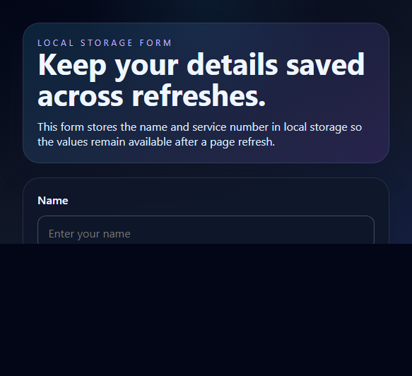

# Local Storage Form

A small React app that saves form entries in browser local storage so the values remain available after a refresh.

## Features

- Store the name and service number in local storage.
- Restore saved values automatically on page load.
- Keep the form behavior simple and easy to maintain.

## Screenshot

## Getting Started

1. Install dependencies
   npm install
2. Start the development server
   npm run dev
3. Run the test suite
   npm run test

## Project Notes

The form uses a custom hook, useLocalStorage, to read and write the values from localStorage. The hook keeps the state and persistence logic in one place, which makes the form easy to extend.
