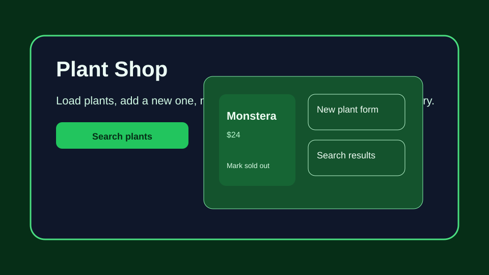

# Plant Shop

Plant Shop is a small React app that loads plants from a backend, lets you add a plant, marks plants as sold out, and filters the inventory by name.

## Features

- Fetches all plants from the backend on page load.
- Adds a new plant through the form and updates the UI instantly.
- Toggles a plant to sold-out status with a button.
- Filters the plant list by name with live search.

## Getting started

1. Install dependencies:
   npm install
2. Start the backend API:
   npm run server
3. Start the React app in another terminal:
   npm run dev
4. Run the tests:
   npm run test

## Usage

- Open the app in the browser.
- The page automatically loads plants from the backend.
- Use the form to add a new plant.
- Use the search box to filter the list by plant name.

## Notes

- The backend is a small Express server defined in server.js and listens on port 3001.
- The app uses the public API endpoint http://localhost:3001/plants for its data operations.
