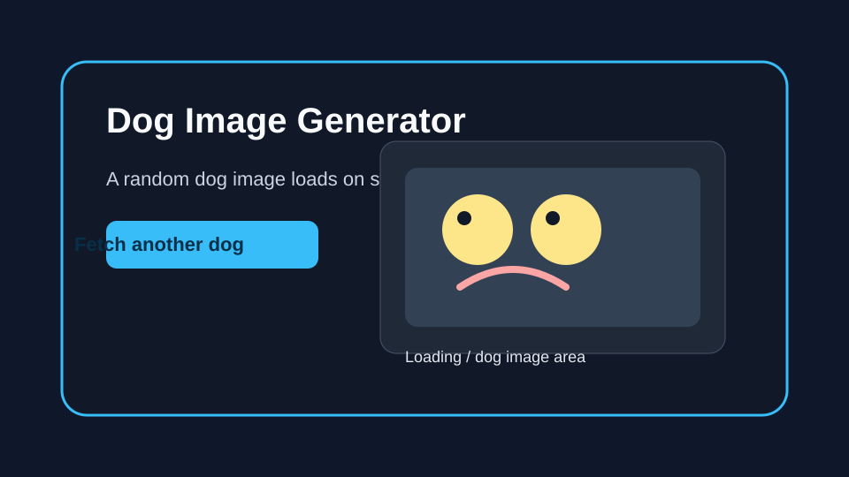

# Dog Image Generator

This app loads a random dog image on startup, shows a loading message while the request is in progress, and lets the user fetch another image with a button.

## Features

- Uses React state with useEffect to fetch a random dog image when the app loads.
- Uses a button click handler to fetch a new image at any time.
- Shows a friendly loading message and handles API errors gracefully.

## Setup

1. Install dependencies:
   npm install
2. Start the development server:
   npm run dev
3. Run the tests:
   npm run test

## Usage

- Open the app in your browser.
- A random dog image appears automatically when the page loads.
- Click the button to request another dog image.

## Notes

- The fetch request uses the public Dog CEO API at https://dog.ceo/api/breeds/image/random.
- The UI keeps the interface simple: one button and one main image display area.
