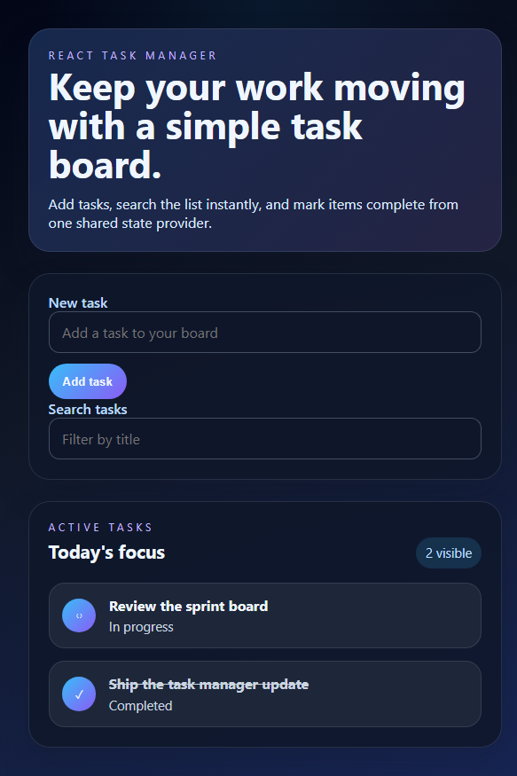

# Task Manager

A React + Vite task manager that keeps task data in shared context, supports dynamic filtering, and persists updates through a simple Node.js backend.

## Highlights

- Add a new task from the form using a stable input id.
- Toggle completion from the task list with shared context state.
- Search tasks instantly with a ref-backed search field.
- Persist changes through the local API and keep the UI in sync.

## Screenshot

## Getting Started

1. Install dependencies
   npm install
2. Start the API backend
   npm run server
3. Start the development app
   npm run dev
4. Run the tests
   npm run test

## Project Structure

- src/App.jsx — main task manager screen and controls
- src/TaskContext.jsx — global state, add/toggle handlers, and filtering logic
- server.js — local API for reading and updating tasks in db.json

## Notes

The app uses React context to avoid prop drilling, a search input reference for quick filtering, and a small JSON-backed backend so completed tasks are written to the local data store as well as the page.
