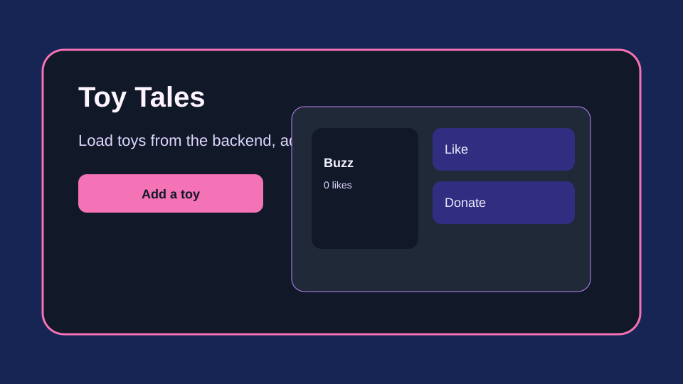

# Toy Tales

Toy Tales shows a toy collection from an Express backend, lets the user add toys, like items, and donate them from the frontend.

## Features

- Fetches all toys from the backend on page load.
- Adds new toys through the form and updates the page immediately.
- Increases toy likes with a button click.
- Removes toys from the page when they are donated.

## Getting started

1. Install dependencies:
   npm install
2. Start the backend server:
   npm run server
3. Start the React app in another terminal:
   npm run dev
4. Run the tests:
   npm run test

## Usage

- Open the app in the browser to see the toy collection.
- Use the form to add a new toy.
- Click Like to increase the likes count.
- Click Donate to remove the toy from the page.

## Notes

- The backend API is defined in server.js and listens on port 3001.
- The app uses the endpoint http://localhost:3001/toys for its data operations.
